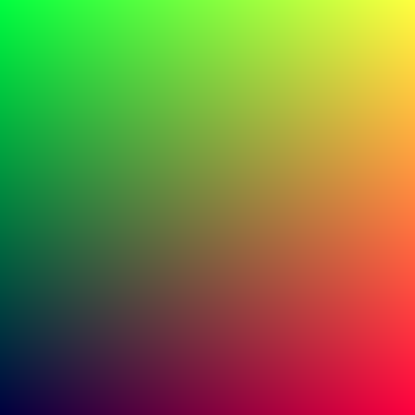
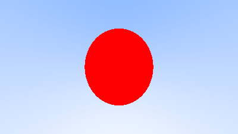
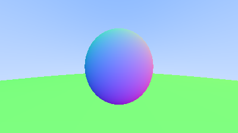
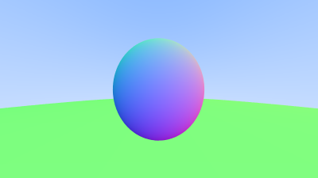

# Ray Tracing in One Weekend Follow up
This is my follow up in the guide [Ray Tracing in One Weekend](https://raytracing.github.io/books/RayTracingInOneWeekend.html).

It's basically the same guide but in C and using a small BMP library.

# Why?
Just for fun and personal joy.

# Examples
### 1 Space

### 2 Blue Gradient

### 3 Sphere

### 4 Shading

### 5 Hittables

### 6 Antialiasing

